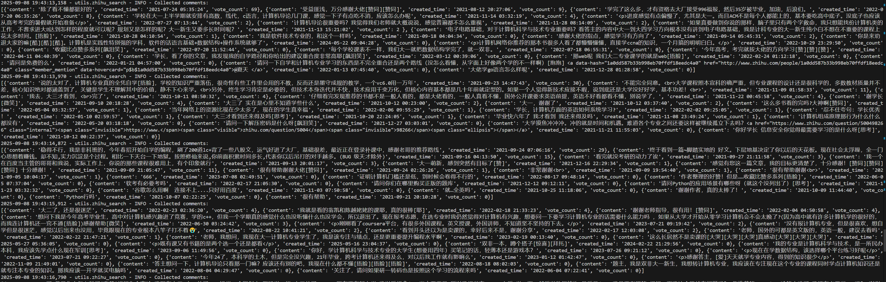
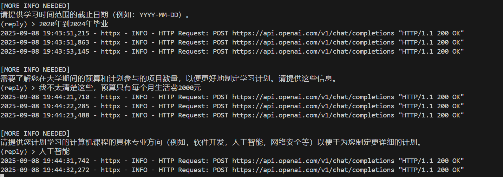

# Adaptive RAG System

> Intelligent Agentic Planner System based on **LangGraph**

[](https://www.python.org/downloads/)
[](https://langchain-ai.github.io/langgraph/)
[](LICENSE)

[中文文档](README.md) | [English Documentation](README_EN.md)

## Project Overview

Adaptive RAG is an intelligent agentic planner system that demonstrates advanced AI orchestration through LangGraph state management. The project focuses on adaptive routing, hybrid RAG (retrieval-augmented generation) and most importantly, a novel planner system that will use related comments of the answer it found from the web search to do the recalibration, it also implement intelligent query classification, human-in-the-loop planning, multi-source information gathering, and conversation management.

## Project Features

- **Technology Stack**: LangGraph + LangChain + OpenAI + ChromaDB
- **Adaptive Query Routing**: Intelligent classification (direct/normal/planner)
- **Human-in-the-Loop Planning**: Interactive information gathering for complex plans
- **Multi-Source Information Gathering**: Web search + Social platforms (Reddit, Zhihu)
- **Advance RAG**: Hybrid document retrieval (Dense + BM25 + Reranking + Compression)
- **Conversation Management**: Auto-summarization + persistent state tracking

## Technology Stack

| Component | Technology | Version | Purpose |
|-----------|------------|---------|---------|
| **Graph Framework** | LangGraph | 0.6+ | State-based agent orchestration |
| **LLM Integration** | LangChain | 0.3+ | Language model integration |
| **Language Models** | GPT-5/GPT-4o/4o-mini | Latest | Text generation and analysis |
| **Vector Database** | ChromaDB | 1.0+ | Document embeddings storage |
| **Web Search** | Tavily API | Latest | Real-time information retrieval |
| **Social Platforms** | Reddit + Zhihu APIs | Latest | Community insights gathering |
| **Database** | SQLite | 3.0+ | Conversation persistence |

## Core Technologies

### 1. Adaptive Query Routing System
- **Intelligent Classification**: Automatic query categorization (direct/normal/planner)
- **Context-Aware Routing**: Dynamic response strategy selection
- **Tool Selection**: Adaptive tool usage based on query complexity

### 2. Human-in-the-Loop Planning
- **Interactive Information Gathering**: Multi-round clarification process
- **Intelligent Sufficiency Detection**: Automatic assessment of information completeness
- **Planning Generation**: Comprehensive plan creation with gathered context

### 3. Multi-Source Information System
- **Web Search Integration**: Real-time information via Tavily API
- **Social Platform Insights**: Community perspectives from Reddit and Zhihu
- **Local Document Retrieval**: Vector-based document search capabilities

### 4. Conversation Management System
- **Auto-Summarization**: Intelligent context compression for long conversations
- **State Persistence**: SQLite-based conversation checkpointing
- **User & Thread Management**: Organized conversation tracking

## Quick Start

### Requirements

- **Python**: 3.13+
- **Memory**: 4GB+ (8GB recommended)
- **API Keys**: OpenAI, Tavily, Reddit (optional)
- **Storage**: 2GB+ for dependencies and data

### Environment Setup

```bash
# 1. Clone the project
git clone https://github.com/your-repo/Adaptive-RAG.git
cd Adaptive-RAG/server

# 2. Install dependencies
pip install -r requirements.txt

# 3. Configure environment
cp .env.example .env
# Edit .env with your API keys

# 4. Run the system
python main.py
```

After setup, the system will guide you through:
- **User Management**: Create or select user profiles
- **Thread Management**: Create or select threads under selected user
- **Interactive Chat**: Adaptive routing and intelligent responses

### Test Planner Core Function
```bash
cd server/tests
python quick_test.py
```

## Project Structure

```
server/
├── main.py                          # Entry point - system launcher with dependency checks
├── requirements.txt                 
├── requirements-lock.txt            
├── .env.example                     
├── .gitignore                       
├── config/
│   ├── __init__.py
│   └── config.py                    # Configuration management and environment variables
├── core/
│   ├── __init__.py
│   ├── run_time.py                  # Main runtime with graph definition
│   ├── nodes.py                     # Graph nodes: router, analyzer, planner, summarizer
│   ├── planner.py                   # Planning system implementation
│   └── db.py                        # Database operations and management
├── data/
├── utils/
│   ├── __init__.py
│   ├── search.py                    # Web_search, advan_web_search for tool-calling
│   ├── retrieve.py                  # Document retrieval utilities
│   ├── reddit_search.py             # Reddit API integration
│   └── zhihu_search.py              # Zhihu platform integration
├── tests/
│   ├── __init__.py
│   └── quick_test.py                # Basic search tests
└── deployment/
```

## Core Algorithms

### 1. Adaptive Routing Strategy
```python
# Query classification using LLM
def classify_query(query):
    # direct: straightforward queries
    # normal: queries needing context consideration  
    # planner: complex queries requiring detailed planning
    return route_classification

# Dynamic workflow selection
def select_tools(route, context):
    if route == "direct":
        return [llm_node, web_search]
    elif route == "normal":
        return [rewrite_node, llm_node, web_search]
    else:  # planner
        return [rewrite_node, analyzer_node, planner_node, advan_web_search]
```

### 2. Human-in-the-Loop Planning
- **Information Gap Analysis**: Identify missing critical information
- **Interactive Clarification**: Multi-round question-answer process
- **Sufficiency Assessment**: Determine when enough information is gathered
- **Plan Generation**: Create comprehensive plans with collected context

### 3. Conversation State Management
- **Auto-Summarization**: Compress long conversations while preserving key information
- **Context Preservation**: Maintain conversation continuity across sessions
- **State Persistence**: SQLite-based checkpointing for conversation recovery

## Configuration Details

### Main Configuration Items
Adjust system parameters in `server/config/config.py`:

```python
# Model configuration
MODEL = "gpt-4o"                            # Primary model
SIDE_MODEL = "gpt-4o-mini"                  # Secondary model for classification
PLANNER_MODEL = "gpt-5"                     # Planning model

# Graph configuration
MAX_ROUNDS = 3                              # Maximum HITL rounds
RECENT_K = 6                                # Recent messages to keep
SUMMARIZE_AFTER = 8                         # Trigger summarization threshold

# Retrieval configuration
CHUNK_SIZE = 835                            # Document chunk size
CHUNK_OVERLAP = 120                         # Chunk overlap
EMB_MODEL = "text-embedding-3-large"        # Embedding model
RERANKER_MODEL = "BAAI/bge-reranker-v2-m3"  # Reranker model
```

### Environment Variable Configuration
Configure `.env` file:
```bash
# Primary configuration
OPENAI_API_KEY=your_openai_api_key
MODEL=gpt-4o
SIDE_MODEL=gpt-4o-mini
PLANNER_MODEL=gpt-5
TAVILY_API_KEY=your_tavily_api_key

# Retrieval configuration
EMB_MODEL=text-embedding-3-large
RERANKER_MODEL=BAAI/bge-reranker-v2-m3

# Reddit client parameters (optional)
CLIENT_ID=your_reddit_client_id
CLIENT_SECRET=your_reddit_client_secret
REDDIT_PASSWORD=your_reddit_password
REDDIT_USERNAME=your_reddit_username
USER_AGENT=python:mybot:v1.0 (by u/your_username)

# LangSmith settings (optional)
LANGSMITH_TRACING=true
LANGSMITH_ENDPOINT=https://api.smith.langchain.com
LANGSMITH_API_KEY=your_langsmith_api_key
LANGSMITH_PROJECT=Adaptive-rag
```
#### web search based on social platforms

#### Human-in-the-loop


## License

This project is licensed under the [MIT License](LICENSE).

---

### If this project helps you, please give it a Star!

**Technology Stack**: Python + LangGraph + LangChain + OpenAI + ChromaDB
**Email**: jianwend@vt.edu
**Project URL**: https://github.com/Golaugh/Adaptive-rag

[中文文档](README.md) | [English Documentation](README_EN.md)
